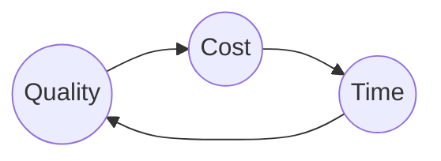

---
layout: post
title: Project Management
categories: [Tech, Research]
---

Twelve (12) steps to Managing Project Successfully:

1. Define the project
2. List the tasks
3. Plan the running order
4. Add contingency
5. Considering crashing
6. Make a Gnatt chart
7. Calculate resource management.
8. Assess risks and prepare for action 
9. Monitor project using Gnatt chart.
10. Monitor cost
11. Readjust your plan
12. Review

The first 8 are planning and the last 3 are actions. 

The Iron Triangle:

1. Quality
2. Cost
3. Time

The reason why is it called an iron triangle because this is a hard constraint and non-negotiable. Bosses always want these three together, but it is very difficult to get all the three triangle at the same time. 

So, the first thing to do are:

- What do they want?
- By when?
- How much can they pay?

Plan before you commit:

- Say yes **ONLY** when you are absolutely sure that you can do it.
- Say no when anything in any doubt
- Ask for adjustments if anything doesn't meet according to you
- Don't say *'May be'.* (Customer will think it to be yes)
- Dont say *'I will see what I can do'* (Customer will think it to be yes)

> If your boss asks you to do a project within a borderline-impossibly tight time frame, which approach would you take in answering?
> Create a Gantt chart and say, "Yes, but only with adjustments."

Find your key driver: 
Example: For an Olympic, they key is Time. No matter what happens it has to start on time. For a Nuclear Power plant, they key is quality. For a hospital, the key may be money and quality. 
No one will tell you that, you have to find it out by yourself. 

> 3 questions that may help you to find this key or priority from your customers:
> 1. Why that budget or time?
> 2. What if?
> 3. Can we trade? If they are willing to avail a better service for a smaller increase in cost?
> Example: Your customer has not specifically stated that money is their key driver, although you suspect that it is. Which question can you ask your customer to determine whether, in fact, money is their key driver?
> Ask: Would you like us spend a little bit more in order to add some great extra features?
> If you offer additional features but the customer declines, then this tells you the customer's key driver is money.

### Listing Project Tasks

1. Hold a brainstorming meeting
2. Categorise tasks
3. Ask others

Choose the level of granularity. If you can't estimate task might be quite big. Breakdown until you can estimate task. The 'O' word - *ongoing*.

Choose right level of granularity. Not too little, and not too much. 

### Plan the Running Order

Make network diagram from start to finish based on the listed tasks
Identify the critical paths. Critical tasks are the most time taking tasks which are imperative for the success of the project. These tasks are critical because they are the tasks that determine how long the project is going to take.

The typical practice for estimating durations at this stage is using average time frames in weeks. Contingencies can be added later.

### Add Contingency

Adding a safety margin:  Find out the mid-point between average and the worst. This point is the point which is 90% safe as well as way above the average. This will keep some provision and also help you to show strong competency.

Spread the safety margin across all the tasks in the critical path instead of just adding it to a single task. 

### Crashing (Speeding up the project)

The way to speed things up, there are ways depending on where you want to cut corners. 
- Cost
	More resources: people, hour, equipment
-  Quality
	Take out extras.
- Time
	Overlapping tasks like buying equipment priorly. 

But no matter what **Don't** bend your estimates to fit the requirement. 
Also, **Don't** take out your contingencies. Improve quality, or money up or overlap task. This is because a project needs the contingency to support unplanned events.

When time is a constrains, and you have already crashed in on it, take out some of the "nice-to-haves.". The nice-to-haves are optional items, not essential, that a customer is willing to give up in order to have the project delivered on time.

### Gantt Chart

It's a chart showing all the chart drawn along the timeline. They are drawn out to scale. 
Creating it is easy if you have the posted notes at your hand. 

1. Put a list of tasks on the left hand side (in a column or two). Critical tasks should be put first and then the floating tasks below that. 
2. Put the weeks at the top row by date. You already know by now that how many weeks you will need to complete the entire task. 
3. Next shade the entire duration of the critical tasks at different rows. This will come down as steps. Include the contingencies. 
4. Add the verticals for the subsequent floating tasks 
5. Add the floating tasks, and put arrows to mark it as a floating task. Constrain the domain of floating with an arrow. 

Why Gantt chart is very helpful:

1. Communication 
2. Resource Planning
3.  Checking Progress
4. Interpreting Costs.

Create one Gantt for number of hours/day, and another one for amount of money required/week. 

We can also create Sub-Gantt chart for each task which are considerably large and needs to be broken down further. 
Sum over the items in last column and last row and compare them with the total available resources that you have. 

**Gantts of Gantt** is a combination of Gantt charts with proper date line but in separate rows. Gantts of Gantt helps to keep track of many different projects at a time. 

### Risk Management 

To draw a risk assessment chart, one needs to draw 7 column chart:
Column 1. Description of risk
Column 2. Risk factor (how likely) 1-5
Column 3. Impact factor (how serious) 1-5
Column 4. Weighted factor (risk x impact) 1-25
Column 5. Preventive action plan (reduce likelyhood)
Column 6. Protective action plan (reduce impact)
Column 7. Risk x Impact = weighted factor *after* mitigation. 

### Monitor Progress

The way to monitor progress is by colouring the today column on a Gantt chart with a highlighter and also the amount of work done in each task with the same highlighter. 

### Monitor Cost

The accountant of the project will keep track of the costs of the project at each point of the project. But only money do not give any good idea about the wellness of the project. Sometimes we can be overspent, or underspent. 
An extra progress with slight increase in the expenditure as of the current date is a good thing, but too much underspent can be an alert for some suspicious activity. 
All this can be understood when the accountant sits with the project manager who has a Gantt chart. 

*How to forecast future cost?*
Make a table with four tows and 3 column.
|                      | Start | Halfway | Finish |   |
|----------------------|-------|---------|--------|---|
| Plan                 |       |         |        |   |
| Actual so far        |       |         |        |   |
| Optimistic forecast  |       |         |        |   |
| Pessimistic forecast |       |         |        |   |

### Re-adjust the Plan

In-order to see the progress and adjust instantly and efficiently, you need to consider replanning during the middle third of the project. 
So if it is 9 months project, that will be the months 4,5 and 6. 

### Review

Questions to be asked:
1. Good to repeat?
2. Bad to avoid next time?
3. Different next time? 

Things to retain as document:
1. Gantt chart
2. Review form

The review form serves as a learning for future projects.

 
